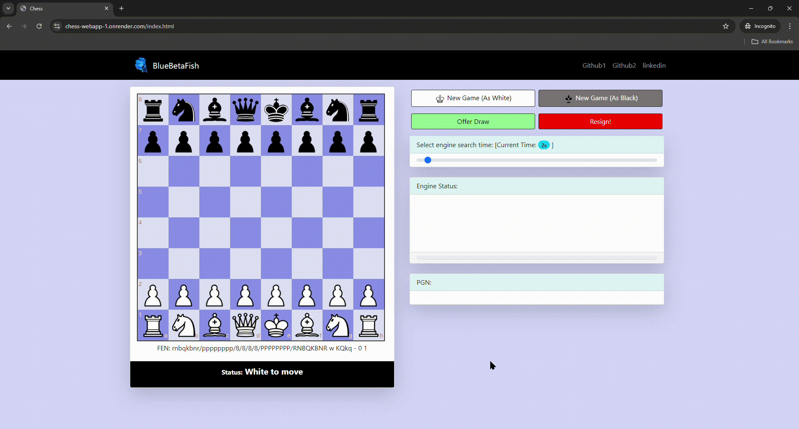

# chess-webapp
- GUI web page to play against BlueBetaFish (CLI chess engine).
- BlueBetaFish source code: https://github.com/BlueBetaFish/chess-engine

    

    

-----------
---------
----------

## Project structure
- Backend service is developed using Java/Spring.
- API to get best move: `/api/bestmove/fen={FEN}&movetime={MOVE_TIME}`
    - FEN: chess board position in FEN string notation
    - MOVE_TIME: amount of time the engine should search the position
    - Whenver the API is hit, a new chess engine (child process) process is spawned. 
    - URL for homepage: `/index.html`
    - `neatchess` library is used as UCI engine wrapper.
        - Adapter pattern: [The UCI engine is a command-line program, and input/output operations are supported via stdin and stdout. To use this program in a Java application, a wrapper class is needed to spawn a process and provide Java method APIs for communication with the process via stdin and stdout] 
        
- `src\main\resources\static` contains the front-end code.
    - `chessjs` library is used for validating chess moves using JavaScript on front-end.
    - `chessboardjs` library is used as the UI library on front-end.

-----------
------------
----------

## Acknowledgments

This project makes use of the following open source libraries:

- [neat-chess](https://github.com/nomemory/neat-chess): UCI chess engine adapter class in Java.
- [chessboardjs](https://github.com/oakmac/chessboardjs/): A JavaScript chessboard UI component.
- [chessjs](https://github.com/jhlywa/chess.js/tree/master): A JavaScript library for validating chess moves and checkmates/stalemates.
